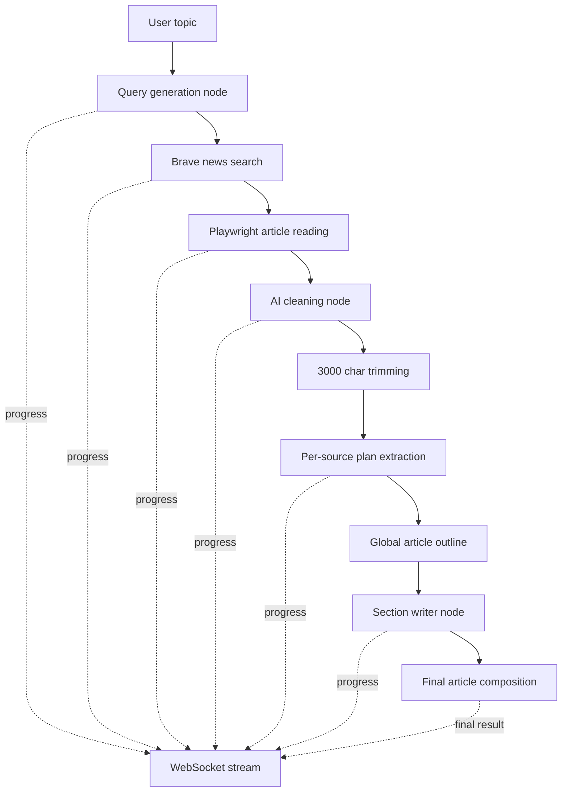

# Web Recap

Web Recap is a bilingual news synthesis tool built as a static frontend plus a clean FastAPI backend monolith. A user enters a topic, the backend searches recent news with Brave, opens each source with Playwright, cleans the extracted article bodies, builds a recap plan with LangGraph, writes the final article with OpenAI models, and streams progress to the UI in real time.

## Stack

- Backend: FastAPI, LangGraph, LangChain, OpenAI, Playwright, Pydantic Settings
- Frontend: HTML, Tailwind CSS, Alpine.js, Marked
- Runtime: Python with `uv`
- Models: `gpt-4o-mini` for higher-level planning and `gpt-4.1-nano` for cheaper structured subtasks

## Features

- English and French interface
- Brave News search with selected-language first and English fallback
- Playwright article reading with browser visibility controlled by env var
- AI cleaning step to remove noise such as social prompts, sponsor blocks, and related links
- Per-source truncation to 3000 characters after cleaning
- LangGraph workflow with separated prompt responsibilities and structured outputs
- WebSocket event streaming for live progress updates
- Final article rendering with source references and favicons

## Project Structure

```text
.
├── .env.example
├── app/
│   ├── core/
│   │   ├── config/
│   │   └── runtime/
│   ├── main.py
│   └── modules/
│       └── recap/
│           ├── application/
│           │   ├── dto/
│           │   └── services/
│           │       ├── chains/
│           │       └── prompts/
│           ├── domain/
│           │   ├── entities/
│           │   └── repositories/
│           ├── infrastructure/
│           │   ├── llm/
│           │   ├── scraping/
│           │   └── search/
│           └── presentation/
│               └── routes/
├── frontend/
│   ├── css/
│   ├── js/
│   ├── locales/
│   └── index.html
├── tests/
│   ├── e2e/
│   ├── integration/
│   └── unit/
└── pyproject.toml
```

## Architecture

The backend follows a modular clean-monolith split.

- Domain: pure recap entities and gateway contracts
- Application: DTOs, text helpers, prompt definitions, LCEL chains, and the LangGraph workflow
- Infrastructure: Brave API client, Playwright article reader, and OpenAI model factory
- Presentation: FastAPI routes for job submission and WebSocket streaming

The frontend remains static and separate from backend business logic.

- `frontend/index.html` contains structure only
- `frontend/css/styles.css` contains custom styling
- `frontend/js/script.js` contains client behavior and WebSocket handling
- `frontend/locales/*.json` contain translations

## AI Workflow



## Request Flow

1. The frontend sends `POST /api/recaps` with `topic` and `language`.
2. The backend creates an ephemeral job id and starts the LangGraph workflow in the background.
3. The frontend connects to `WS /api/recaps/{job_id}/stream`.
4. Progress events are pushed as each node starts or finishes.
5. The final event contains the generated Markdown article and normalized references.

## Environment

Copy `.env.example` to `.env` and set:

- `OPENAI_API_KEY`
- `BRAVE_API_KEY`
- `APP_HOST`
- `APP_PORT`
- `HEADLESS_BROWSER`
- `MAX_ARTICLES`
- `JOB_TTL_SECONDS`

`HEADLESS_BROWSER=false` opens a visible Chromium browser for Playwright runs.

## Local Setup

```bash
uv sync --all-groups
uv run playwright install chromium
copy .env.example .env
```

Then run the app:

```bash
uv run uvicorn app.main:app --reload
```

Open `http://127.0.0.1:8000`.

## Tests

Run the focused test suite:

```bash
uv run pytest
```

Current test coverage includes:

- Unit tests for text normalization helpers
- Integration tests for Brave result mapping and language fallback behavior
- End-to-end API/WebSocket flow tests with a fake workflow service

## Notes

- Job storage is in-memory only in this version.
- Some publishers may block automated reading or load content dynamically in ways that require scraper tuning.
- Favicons use Brave profile images when available and a domain-based fallback otherwise.
- The frontend uses CDN-delivered Tailwind, Alpine.js, and Marked to keep the static layer simple.
